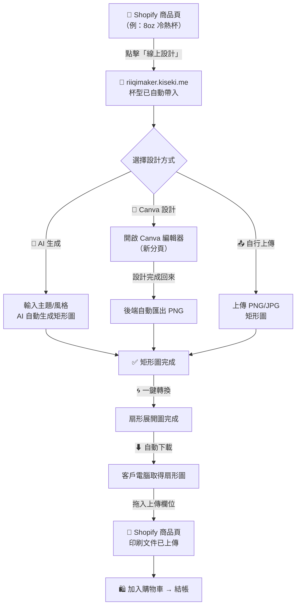

# 🧭 Riiqi 紙杯客製化 — 完整期望流程

---

## 一、全局流程圖



---

## 二、客戶操作步驟（Canva 路線）

| 步驟 | 客戶做什麼 | 在哪裡 | 系統自動做什麼 |
|------|-----------|--------|--------------|
| ❶ | 瀏覽商品，點「線上設計」 | Shopify 商品頁 | 帶 `?cup=1&mode=canva` 跳轉 |
| ❷ | 看到杯型已選好，點「連接 Canva 帳號」 | riiqimaker.kiseki.me | OAuth 授權流程 |
| ❸ | Canva 授權同意 | Canva.com | 取得 access_token，跳回 |
| ❹ | 點「開啟 Canva 設計」 | riiqimaker.kiseki.me | API 建立正確尺寸的 Design，開新分頁 |
| ❺ | 在 Canva 自由設計紙杯圖案 | Canva.com（新分頁） | — |
| ❻ | 設計完成，回到原頁面，點「匯出矩形圖」 | riiqimaker.kiseki.me | API 匯出 PNG → 下載到伺服器 |
| ❼ | 點「開始轉換扇形圖」 | riiqimaker.kiseki.me | 極座標 Warp 自動轉換 |
| ❽ | 點「下載扇形圖」 | riiqimaker.kiseki.me | 瀏覽器下載檔案 |
| ❾ | 把扇形圖拖入上傳欄位 | Shopify 商品頁 | 檔案附加到訂單 |
| ❿ | 加入購物車 → 結帳付款 | Shopify 商品頁 | 訂單成立 ✅ |

---

## 三、客戶操作步驟（AI 生成路線）

| 步驟 | 客戶做什麼 | 在哪裡 |
|------|-----------|--------|
| ❶ | 點「線上設計」 | Shopify 商品頁 |
| ❷ | 杯型已選好，選「🤖 AI 幫我生成」 | riiqimaker.kiseki.me |
| ❸ | 輸入主題、風格、文字 → 點「開始生成」 | riiqimaker.kiseki.me |
| ❹ | 等待 AI 生成（約 10~30 秒） | riiqimaker.kiseki.me |
| ❺ | 點「開始轉換扇形圖」 | riiqimaker.kiseki.me |
| ❻ | 下載扇形圖 → 拖入 Shopify → 結帳 | Shopify 商品頁 |

---

## 四、客戶操作步驟（自行上傳路線）

| 步驟 | 客戶做什麼 | 在哪裡 |
|------|-----------|--------|
| ❶ | 點「線上設計」 | Shopify 商品頁 |
| ❷ | 杯型已選好，選「📤 自行上傳」 | riiqimaker.kiseki.me |
| ❸ | 上傳自己做好的矩形圖 | riiqimaker.kiseki.me |
| ❹ | 點「開始轉換扇形圖」 | riiqimaker.kiseki.me |
| ❺ | 下載扇形圖 → 拖入 Shopify → 結帳 | Shopify 商品頁 |

---

## 五、畫面流程（Canva 路線）

```
┌─────────────────────────────────────────────────┐
│ 🛒 Shopify 商品頁                                │
│                                                  │
│  ┌─────────────┐                                 │
│  │  8oz 冷熱杯  │  NT$XXX                        │
│  │             │                                 │
│  │  [線上設計]  │ ← 點這個                        │
│  │  [下載刀模]  │                                 │
│  └─────────────┘                                 │
└──────────────────┬──────────────────────────────┘
                   ↓
┌─────────────────────────────────────────────────┐
│ 🎨 riiqimaker.kiseki.me                          │
│                                                  │
│  Step 1：選擇杯型                                 │
│  ┌──────────────────────────────────────┐        │
│  │ ✅ 8oz 冷熱杯（已自動選取）            │        │
│  │ 📐 矩形圖尺寸：2372 × 1048 px        │        │
│  └──────────────────────────────────────┘        │
│                                                  │
│  Step 2：製作矩形圖                               │
│  ┌──────────────────────────────────────┐        │
│  │ [🤖 AI 生成] [🎨 Canva 設計] [📤 上傳]│        │
│  │              ↑ 自動選中                │        │
│  │                                       │        │
│  │  ┌────────────────────────────┐       │        │
│  │  │ 🔗 連接 Canva 帳號         │       │        │
│  │  └────────────────────────────┘       │        │
│  └──────────────────────────────────────┘        │
└──────────────────┬──────────────────────────────┘
                   ↓ 授權完成
┌─────────────────────────────────────────────────┐
│  │  ┌────────────────────────────┐       │       │
│  │  │ 🎨 開啟 Canva 設計         │       │       │
│  │  └────────────────────────────┘       │       │
│  │  點擊後在新分頁開啟 Canva 編輯器      │       │
└──────────────────┬──────────────────────────────┘
                   ↓ 新分頁
┌─────────────────────────────────────────────────┐
│ 🎨 Canva.com（新分頁）                            │
│                                                  │
│  ┌──────────────────────────────────────┐        │
│  │         Canva 編輯器                  │        │
│  │    （尺寸已自動設定 2372×1048）        │        │
│  │                                      │        │
│  │    客戶自由設計紙杯圖案               │        │
│  │    · 拖拉素材                         │        │
│  │    · 加文字                           │        │
│  │    · 換背景                           │        │
│  │    · 用模板                           │        │
│  └──────────────────────────────────────┘        │
│  客戶設計完成後，切回 riiqimaker 分頁              │
└──────────────────┬──────────────────────────────┘
                   ↓ 回到原頁面
┌─────────────────────────────────────────────────┐
│  │  ┌────────────────────────────┐       │       │
│  │  │ ✅ Canva Design 已建立！   │       │       │
│  │  │                            │       │       │
│  │  │ 📥 從 Canva 匯出矩形圖     │       │       │
│  │  └────────────────────────────┘       │       │
│  │                                       │       │
│  │  ████████████████████ 100%            │       │
│  │  匯出完成！                            │       │
│  │                                       │       │
│  │  ┌──────────────────────────┐         │       │
│  │  │ ✅ 矩形圖已準備完成       │         │       │
│  │  │ 🌀 開始轉換扇形圖         │         │       │
│  │  └──────────────────────────┘         │       │
└──────────────────┬──────────────────────────────┘
                   ↓
┌─────────────────────────────────────────────────┐
│  Step 3：下載你的檔案                             │
│  ┌──────────┐  ┌──────────┐                      │
│  │ 矩形圖    │  │ 扇形圖    │                      │
│  │ [⬇ 下載] │  │ [⬇ 下載] │                      │
│  └──────────┘  └──────────┘                      │
└──────────────────┬──────────────────────────────┘
                   ↓
┌─────────────────────────────────────────────────┐
│ 🛒 回到 Shopify 商品頁                            │
│                                                  │
│  印刷文件上傳：[ 拖入扇形圖檔案 ]                  │
│                                                  │
│  [ 加入購物車 ] → 結帳 → 訂單成立 ✅               │
└─────────────────────────────────────────────────┘
```

---

## 六、三種路線比較

| | 🤖 AI 生成 | 🎨 Canva 設計 | 📤 自行上傳 |
|---|---|---|---|
| **適合誰** | 沒有設計能力的客戶 | 想自己動手設計的客戶 | 已有設計檔的專業客戶 |
| **設計自由度** | ⭐⭐ 低（靠 prompt） | ⭐⭐⭐⭐⭐ 最高 | — |
| **需要帳號？** | 不需要 | 需要 Canva 帳號（免費） | 不需要 |
| **操作步驟** | 6 步 | 10 步 | 5 步 |
| **時間** | 1~2 分鐘 | 5~30 分鐘 | 1 分鐘 |
| **離開網站？** | 不離開 | 新分頁到 Canva | 不離開 |

---

## 七、系統架構

```
客戶瀏覽器
    │
    ├── Shopify 商品頁（store.riiqi.com.tw）
    │       │
    │       └── 「線上設計」按鈕 → riiqimaker.kiseki.me?cup=1&mode=canva
    │
    ├── riiqimaker.kiseki.me（Zeabur 託管）
    │       │
    │       ├── Flask 後端
    │       │     ├── Canva OAuth（/canva/auth, /canva/callback）
    │       │     ├── Canva API（建立 Design, 匯出 PNG）
    │       │     ├── AI 生成（Gemini / FLUX）
    │       │     ├── 圖片上傳 + 驗證
    │       │     └── 極座標 Warp（矩形 → 扇形）
    │       │
    │       └── 前端（HTML/CSS/JS）
    │             ├── 杯型選擇
    │             ├── 三個 Tab（AI / Canva / 上傳）
    │             └── 下載結果
    │
    └── Canva.com（新分頁）
            └── 客戶在此設計
```
